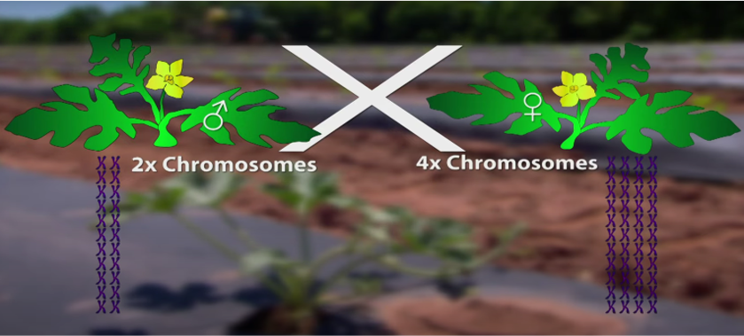
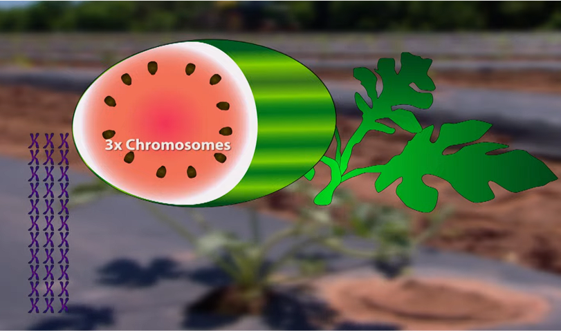
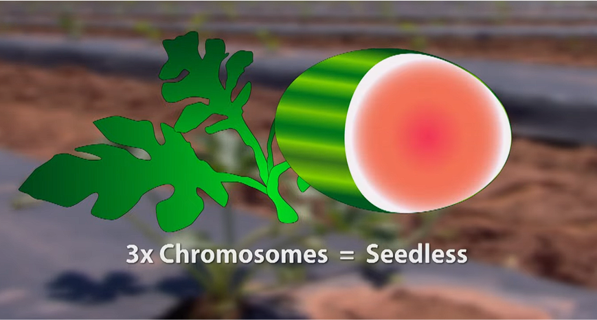
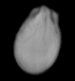
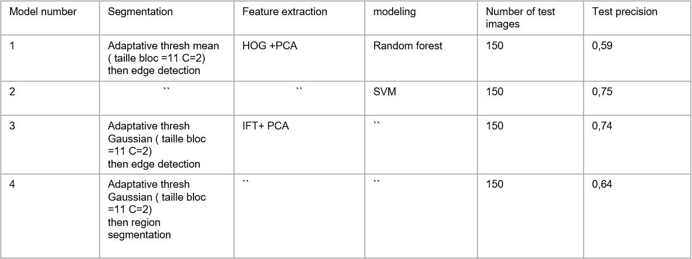
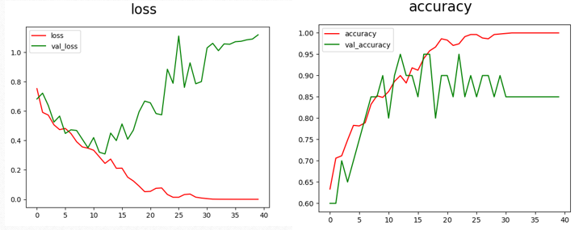
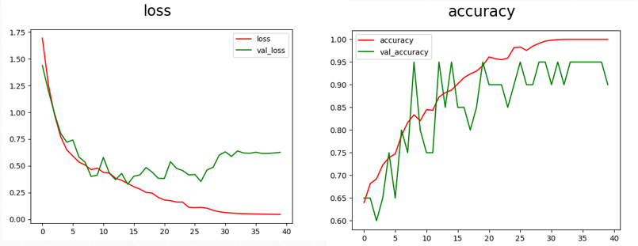
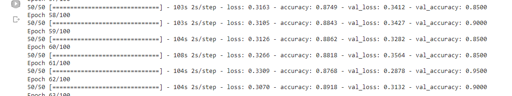

# WatermelonSeedClassifier
### Project context
The Watermelon Seed Classifier project is a result of the Validation of Conception and Development project module at ENSI School for the second semester of the second year. </br> </br>
<p align="center">  </p>  </br> </br>

This project is proposed by the R&D Department of Limagrain Group, under the guidance of **Mr. Ali Boudjedra** the R&D Senior Project Leader in Artificial Vision, AI & Automation.

### About the host organization
<p align="center">  </p>  </br> </br>

[Limagrain Group](https://www.limagrain.com/) is a renowned international agricultural cooperative specializing in plant breeding and seed production. With a rich history spanning several decades, Limagrain has established itself as a leading global player in the seed industry. Their commitment to innovation and sustainable agriculture has led them to explore cutting-edge technologies, including artificial vision and AI, to enhance seed-related processes and deliver high-quality agricultural solutions.
## Problematic

The watermelon production industry is rapidly expanding and becoming increasingly favored for its profitability. Seedless watermelons are particularly sought after for their convenience, reduced risk of injury for children and the elderly, longer shelf life, smoother texture, and sweeter flavor compared to seeded varieties.

However, obtaining seedless watermelons presents challenges due to their tendency to be triploid (3n chromosomes). To address this, pollination between diploid and tetraploid plants is used to produce triploid watermelons. 
<p align="center"> 

Infact the fruit of this pollination is a watermelon with seeds that gives later 3n watermelons.
|                                                                                                             |                                                                                                 |
| ------------------------------------------------------------------------------------------------------------| ----------------------------------------------------------------------------------------------- |
| <p>  </p>|  <p>  </p> |

</br>
The self-pollinating nature of triploid watermelons introduces uncertainty in seed classification since tetraploid plants can pollinate themselves giving seeds of 4n watermelons later , making it difficult to differentiate between triploid and tetraploid seeds. </br>

### Goal 
Our project aims to develop an automated computer tool using machine learning techniques to classify watermelon seeds as triploid or tetraploid, assisting experts in the process. The developed models will classify individual seeds independently, irrespective of surrounding seeds or external factors, providing a time-efficient and accurate seed selection process.
## Needs Analysis
### Actors
Seed Technologist team in **Limagrain**
### Functional Needs
1. Read X-ray Images: The system reads X-ray images of watermelon seeds for analysis.
2. Classify Seeds: The tool classifies watermelon seeds as triploid or tetraploid.
3. Visualize Analysis Results: The results of the seed classification analysis are presented in a clear and accessible manner with a statistical chart.
4. Save Data: The analyzed data, including classification results and related information, can be saved for future reference.

### Non-Functional Needs 
1. Accuracy 
2. Reliability
3. Speed
4. Robustness 
5. User-Friendly
6. Scalability
## Implementation
### Business understanding
The "business understanding" phase is a crucial step in the data science process. It involves comprehending the commercial context of data collection and understanding the company's objectives. Close collaboration between technical and business teams ensures relevant data collection to achieve business goals.

During this phase, we worked with business stakeholders to identify needs, challenges, and propose a solution for automating watermelon seed classification. This alignment ensures an optimized classification process, contributing to the project's success.
### Data Understanding
The dataset comprises the following components:
<div>
  
  <p><strong>2068 X-ray Images:</strong> These images capture the internal structures of watermelon seeds and serve as the primary input for the classification process. The images are grouped into six separate directories for organization.</p>
</div>
<div>
  
  <p><strong>Metadata Excel File:</strong> The accompanying Excel file contains essential metadata corresponding to the X-ray images. This metadata may include seed IDs, dimensions, weight, and other relevant information.</p>
</div>
</br>

</br>

### Data preparation
#### Data cleaning
We initiated the data cleaning process, which involved preparing the images for the subsequent stages by eliminating unclassified or non-3n and non-4n class data. For this task, we utilized Openpyxl, an open-source Python library that allows reading and writing Excel files in xlsx/xlsm/xltx/xltm formats.
Out of the total 2068 images, 1507 were images of triploid and tetraploid seeds. However, these images required cleaning to exclude inaccurate and irrelevant data, which we addressed in the later stages of the project.
```
# Acode example to delete images that have classes different from "3n" and 4n"
import openpyxl
# Call a Workbook() function of openpyxl 
wb_obj = openpyxl.load_workbook('C:\\Users\\lenovo\\Desktop\\Projects\\PCD\\Dataset\\VC374-L2[158].xlsx')
sheet_obj = wb_obj.active
i = 2
while i <= sheet_obj.max_row:
    #print(f'i = {i}\tcell value (i, 1) is {sheet_obj.cell(row=i, column=7).value}')
    if sheet_obj.cell(row=i, column=7).value not in ['3n','4n']:
        sheet_obj.delete_rows(i)
        # Note the absence of incremental.  Because we deleted a row, we want to stay on the same row because new data will show in the next iteration.
    else:
        i += 1
    print(i)    
        # Because the check failed, we can safely increment to the next row.

wb_obj.save('CleanData.xlsx')
```
```
#A code example to divide the cleaned data into two classes "3n" and "4n"
import openpyxl
import shutil
import os

# Load the Excel file
wb_obj = openpyxl.load_workbook('C:\\Users\\lenovo\\Desktop\\Projects\\PCD\\Dataset\\CleanData.xlsx')
sheet_obj = wb_obj.active

# Create folders to store '3n' and '4n' data
os.makedirs('C:\\Users\\lenovo\\Desktop\\Projects\\PCD\\Dataset\\3n', exist_ok=True)
os.makedirs('C:\\Users\\lenovo\\Desktop\\Projects\\PCD\\Dataset\\4n', exist_ok=True)

i = 2
while i <= sheet_obj.max_row:
    cell_value = sheet_obj.cell(row=i, column=7).value

    if cell_value in ['3n', '4n']:
        k = sheet_obj.cell(row=i, column=2).value
        m = sheet_obj.cell(row=i, column=3).value
        n = sheet_obj.cell(row=i, column=4).value

        l = int(((k - 1) // 10) * 10)

        if k < 10:
            source_path = f'C:\\Users\\lenovo\\Desktop\\Projects\\PCD\\Dataset\\{l+1}-{l+10}\\{l+1}-{l+10}\\XRAY_L2_T0{k}_{m}0{n}.bmp'
            target_path = f'C:\\Users\\lenovo\\Desktop\\Projects\\PCD\\Dataset\\3n\\XRAY_L2_T0{k}_{m}0{n}.bmp'
        else:
            source_path = f'C:\\Users\\lenovo\\Desktop\\Projects\\PCD\\Dataset\\{l+1}-{l+10}\\{l+1}-{l+10}\\XRAY_L2_T{k}_{m}0{n}.bmp'
            target_path = f'C:\\Users\\lenovo\\Desktop\\Projects\\PCD\\Dataset\\4n\\XRAY_L2_T{k}_{m}0{n}.bmp'

        shutil.copyfile(source_path, target_path)

    i += 1
```
```
#A code example to put the deleted images from the excel file in a seperate folder to keep track of our data
import openpyxl
import shutil
wb_obj = openpyxl.load_workbook('CleanData.xlsx')
sheet_obj = wb_obj.active
i = 2
j=2
while i <= sheet_obj.max_row:
    k=sheet_obj.cell(row=i, column=2).value
    m=sheet_obj.cell(row=i, column=3).value
    n=sheet_obj.cell(row=i, column=4).value
    if k < 10 :
        
        if  (not ( os.path.exists(f'C:\\Users\\lenovo\\Desktop\\Projects\\PCD\\DataAfterCleaningVisual\\Deleted 3n\\XRAY_L2_T0{k}_{m}0{n}.bmp' )
             or os.path.exists(f'C:\\Users\\lenovo\\Desktop\\Projects\\PCD\\DataAfterCleaningVisual\\Deleted 4n\\XRAY_L2_T0{k}_{m}0{n}.bmp'))):
                sheet_obj.delete_rows(i)
        else:
            i+=1
       
    else:
        if (not ( os.path.exists(f'C:\\Users\\lenovo\\Desktop\\Projects\\PCD\\DataAfterCleaningVisual\\Deleted 3n\\XRAY_L2_T{k}_{m}0{n}.bmp') 
             or os.path.exists(f'C:\\Users\\lenovo\\Desktop\\Projects\\PCD\\DataAfterCleaningVisual\\Deleted 4n\\XRAY_L2_T{k}_{m}0{n}.bmp'))):
                sheet_obj.delete_rows(i)
        else:
            i+=1
    print("i= ",i)  
    j+=1
    print("j= ",j)
        
wb_obj.save('DeletedData.xlsx')
```
#### Data Partitioning 
- Training and Validation Set (90%):
We allocated 90% of the dataset to the training and validation set. This large portion was used for training machine learning models, fine-tuning parameters, and ensuring optimal performance. A portion of the training set was reserved for validation to assess model generalization and prevent overfitting.

- Test Set (10%):
It remained separate during training and validation and was utilized to evaluate the final model's performance. By using unseen data for testing, we obtained an unbiased assessment of the model's ability to classify watermelon seeds accurately.
#### Segmentation + Feature extraction (approch 1 : without Neural Networks)
In the **segmentation** phase, we employed various techniques to partition the watermelon seed images and extract meaningful regions for further analysis.
- **Edge Detection**: We utilized edge detection algorithms to identify and highlight the edges and boundaries of the watermelon seeds. This technique allowed us to distinguish the seeds from the background and provided essential information for accurate segmentation.

- **Adaptive Thresholding**: By using adaptive thresholding, we dynamically adjusted the threshold values for different image regions. This adaptive approach improved the accuracy of segmentation, even under varying lighting conditions or image noise.

- **Region-Based Segmentation**: To group pixels with similar characteristics, we employed region-based segmentation. This technique helped form coherent regions corresponding to individual watermelon seeds, enabling precise delineation and effective separation.

**Extraction of Features:**
In the feature extraction stage, we utilized the following methods to capture relevant information from the segmented regions:

- **Histogram of Oriented Gradients (HOG)**: HOG provided a powerful approach to describe the local gradient directions in the watermelon seed regions. It allowed us to extract distinctive shape and texture features, contributing to accurate classification.

- **Inverse Fourier Transform (IFT)**: By applying the Inverse Fourier Transform, we converted frequency domain information back to the spatial domain. This transformation revealed significant patterns and structures, enabling us to represent the seeds effectively.

- **Dimensionality Reduction with PCA**: To optimize classification performance, we employed Principal Component Analysis (PCA) for dimensionality reduction. This technique reduced the feature space while retaining crucial information, resulting in improved efficiency and accuracy in our classification models.

## Strategy 1

### Image Processing:
- We used adaptive thresholding with a block size of 11 and a constant C of 2.
- An illustrative example with a reference image was provided for clarity.

### Feature Extraction:
- Histogram of Oriented Gradients (HOG) was chosen to extract image characteristics.

### Modeling:
- The model used adaptive thresholding (Adaptive thresh mean) for preprocessing.
- Edge detection was applied to enhance image quality.
- HOG was used for feature representation based on local luminance gradients.
- Principal Component Analysis (PCA) reduced dimensionality to improve classification performance.
- Random Forest classifier was employed for classification.

### Results and Interpretation:
- The model showed overfitting, with a training accuracy of 1.0 and validation accuracy of 0.66.
- The lower test accuracy of 0.59 indicated poor generalization to new data.

## Strategy 2

### Modeling:
- SVM was used as the classification algorithm instead of Random Forest.

### Results and Interpretation:
- The model demonstrated better generalization, with a test accuracy of 0.75.

## Strategy 3

### Image Processing:
- Adaptive thresholding was changed to "Adaptive thresh gaussian" with specific block size and constant C.

### Feature Extraction:
- The Inverse Fourier Transform (IFT) was used instead of HOG for feature extraction.

### Modeling:
- The third model was similar to the second, with different image processing and feature extraction techniques.

### Results and Interpretation:
- The model's performance was comparable to the second strategy.

## Strategy 4

### Image Processing:
- Edge detection was replaced with region-based segmentation, setting the starting point and threshold.

### Modeling:
- The fourth model differed only in the image processing technique from the third model.

### Results and Interpretation:
- The test accuracy decreased to 0.64, suggesting lower generalization compared to previous models.

<p>  </p>
Upon evaluating the results, we concluded that machine learning alone, with a maximum accuracy of 0.75, was not sufficient for our project. As a result, we will proceed with deep learning, specifically neural networks, to achieve higher precision and accuracy.

### modeling with Neural Networks:
For the neural network strategy, we explored transfer learning using pre-trained models as our first step in classification. The following models were evaluated:
| Model Number | Model Name | Test Images Count | Test Accuracy |
|--------------|------------|-------------------|---------------|
| 1            | VGG16      | 150               | 0.827         |
| 2            | ResNet50   | 150               | 0.789         |

- These results motivated us to delve further into the neural network strategy, continuing our pursuit of enhanced accuracy and generalization.
Inspired by the success of VGG16 and ResNet50, we developed a new modified LeNet-5 architecture (v1) tailored to our watermelon seed classification task. The modifications involved using the sigmoid activation function in the output layer and employing average pooling instead of max pooling in the subsampling layers.
```lenet_5_model = keras.models.Sequential([
    keras.layers.Conv2D(6, kernel_size=5, strides=1, activation='relu', input_shape=img_size + (3,), padding='same'),
    keras.layers.AveragePooling2D(),
    keras.layers.Conv2D(16, kernel_size=5, strides=1, activation='relu', padding='valid'),
    keras.layers.AveragePooling2D(),
    keras.layers.Conv2D(120, kernel_size=5, strides=1, activation='relu', padding='valid'),
    keras.layers.Flatten(),
    keras.layers.Dense(84, activation='relu'),
    keras.layers.Dense(10, activation='sigmoid')  # Output layer
])
```
<p>  </p>
- the model did not perform well so we added a Dropout Layer </br> 
the new architecture became: </br>

```
keras.layers.Dense(84, activation='relu'),
keras.layers.Dropout(0.25),
keras.layers.Dense(10, activation='sigmoid') #Output layer   
```

</br>

- No significant change
- We removed the Dropout Layer and added a L1 regularizer :
  </br>
  ```
  keras.layers.Dense(10, activation='sigmoid', kernel_regularizer=l1(0.01)) #Output layer
  ```

<p>  </p> </br>

- We introduced a new version of the LeNet-5 architecture, named "lenet_5_model," with several improvements for watermelon seed classification:
 
 
``` lenet_5_model = keras.models.Sequential([
    keras.layers.Conv2D(6, kernel_size=5, strides=1, activation='relu', input_shape=img_size + (3,), padding='same'),  
    keras.layers.AveragePooling2D(),  
    keras.layers.Conv2D(16, kernel_size=5, strides=1, activation='relu', padding='valid'),  
    keras.layers.AveragePooling2D(),  
    keras.layers.Flatten(),  
    keras.layers.Dense(units=120, activation='relu'),  
    keras.layers.Dense(units=84, activation='relu'),  
    keras.layers.Dropout(0.25),
    keras.layers.Dense(units=2, activation='softmax')  # Output layer
])
```
</br>
This version includes an additional convolutional layer (layer 6) with 120 filters and a ReLU activation function. It also has two fully connected layers (layers 7 and 8) with 120 and 84 units, respectively, before the output layer.
In contrast to the first architecture, which had an output layer with 10 units and a sigmoid activation function, the second architecture has an output layer with 2 units and a softmax activation function. Both architectures share the LeNet-5 foundation but differ in the number of layers, units, and activation functions used in the output layer.

- In our experiments, we tested the second version with a modified training set by applying data augmentations, including shear_range=0.2, zoom_range=0.2, and horizontal_flip=True.
- However, this version exhibited slow training progress and challenges with early stopping. We continue to refine the architecture and training process to achieve optimal watermelon seed classification results.
- we added a **Dropout layer**
- the result wasn't  as good as we expected:
<p>  </p> </br>
- Trainingset is not modified in this case ( no data augmentation) + drop out layer 
<p>  </p> </br>


## Environment dependencies </br>
### Modeling
For the modeling phase , you need to create a seperate environment on anaconda different from the base env:
- Python 3.7.16
- libraries : </br>
              - tensorflow Version: 2.10.0</br>
              - matplotlib Version: 3.5.2</br>
              - numpy Version: 1.21.5</br>
              - sk learn Version: 1.0.2 ( for the ml approch)</br>

### GUI
To view the GUI first you need to : <br />
1. Download streamlit in your work environment ; can be the base env ( it should contain Python version 3.9.13 ) <br />
streamlit Version: 1.21.0

2. Download this streamlit component <br />
```
pip install st-pages 
``` 
in your work environment : you can view its documentation through [this link](https://github.com/blackary/st_pages ) <br />
3. Join the model.h5 file in the folder containing all the files of the main branch  locally as it was too heavy to be uploaded on github <br />
4. To run the app : - streamlit run Complete_Path/app.py <br />

pandas Version: 1.4.4 <br />
numpy Version: 1.23.5 <br />
PIL <br />
Plotly Version: 5.9.0 <br />
